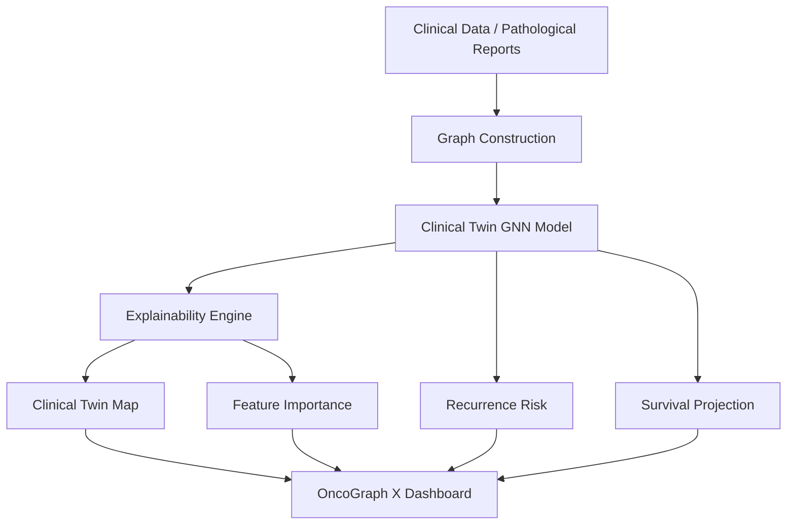

# 🧬 OncoGraph X: Explainable Clinical Twin Analytics

[](https://nextjs.org/)
[](https://fastapi.tiangolo.com/)
[](https://pytorch-geometric.readthedocs.io/)
[](DEPLOY.md)

**OncoGraph X** is a state-of-the-art Clinical Decision Support System (CDSS) that leverages **Graph Neural Networks (GNNs)** to predict cancer recurrence and survival rates. Unlike traditional black-box AI, OncoGraph X utilizes the "Clinical Twin" methodology to provide transparent, evidence-based predictions by identifying historical patients with similar pathological and clinical profiles.

---

## 🌟 Key Features

- **Clinical Twin Mapping**: Visualizes the "Twins" (similar historical cases) that the model uses to derive its predictions.
- **Dual-Task GNN**: Simultaneously predicts **Recurrence Probability** and **Estimated Survival Rate**.
- **XAI (Explainable AI)**: Integrated feature importance scores (via GNNExplainer logic) showing which clinical markers (e.g., Blood work, Tumor Site, Stage) driven the results.
- **Interactive Dashboard**: A premium, high-performance interface built with Next.js and FastAPI.
- **Clinical Interpretability**: Designed for oncologists to verify AI logic through historical evidence.

---

## 🏗️ Architecture



---

## 🛠️ Technology Stack

| Layer | Technology |
| :--- | :--- |
| **Frontend** | Next.js 14, React, Framer Motion, Lucide Icons |
| **Backend API** | FastAPI, Uvicorn, Gunicorn |
| **Analytics** | Streamlit (Experimental/Internal tool) |
| **AI/ML** | PyTorch Geometric (GNN), Pandas, NumPy |
| **Visualization** | Plotly, Pyvis, D3.js |
| **Deployment** | Render (API), Vercel (Frontend) |

---

## 🚀 Getting Started

### 1. Backend Setup (API)
```bash
# Install dependencies
pip install -r requirements.txt

# Run the FastAPI server
python main.py
```
*API will be available at `http://localhost:8000`*

### 2. Frontend Setup
```bash
cd frontend

# Install dependencies
npm install

# Run the development server
npm run dev
```
*Dashboard will be available at `http://localhost:3000`*

### 3. Analytics Dashboard (Streamlit)
For a standalone analytical view:
```bash
streamlit run app.py
```

---

## 📁 Project Structure

- `/frontend`: Next.js application (The main user interface).
- `/src`: Core logic for data preprocessing, GNN model architecture, and explanation modules.
- `/data`: Clinical and pathological datasets.
- `/models`: Saved PyTorch model checkpoints (`.pth`).
- `main.py`: FastAPI entry point for production.
- `app.py`: Streamlit entry point for rapid clinical prototyping.
- `evaluate.py`: Model evaluation and performance metrics script.

---

## 📄 License & Research
This project is developed for clinical research and decision support. 
For deployment instructions, see [DEPLOY.md].

---
*Created with ❤️ by the OncoGraph X Team.*
